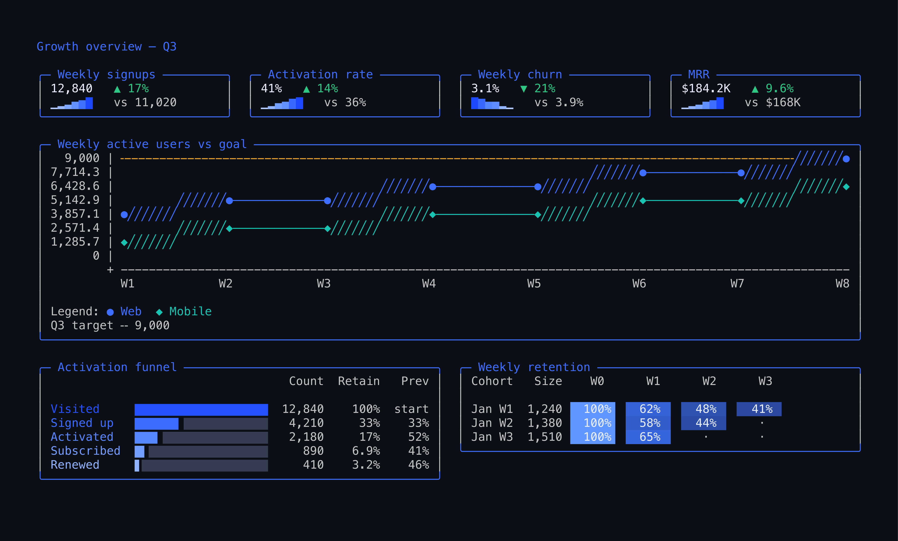
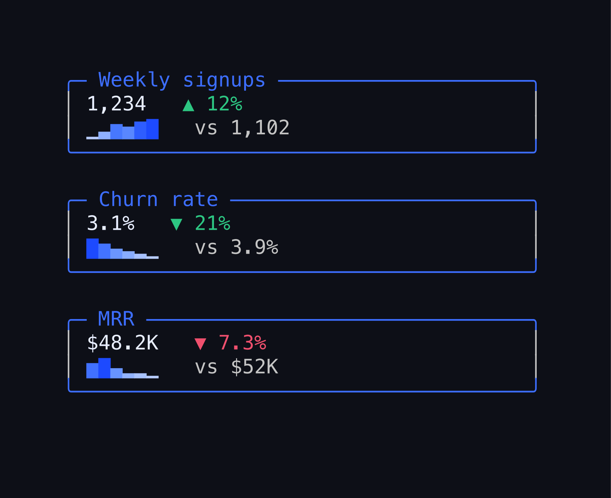
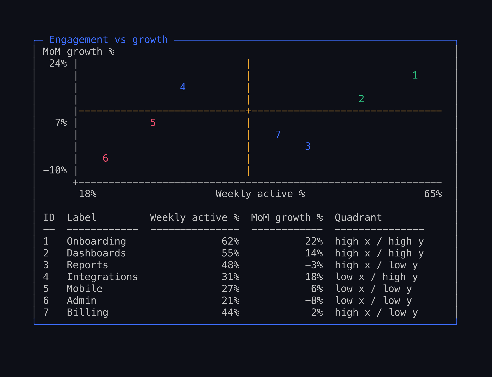
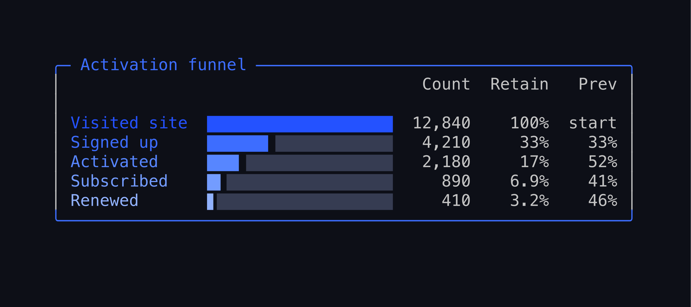
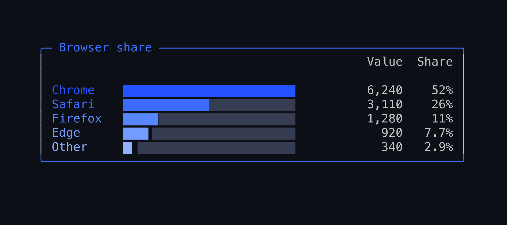
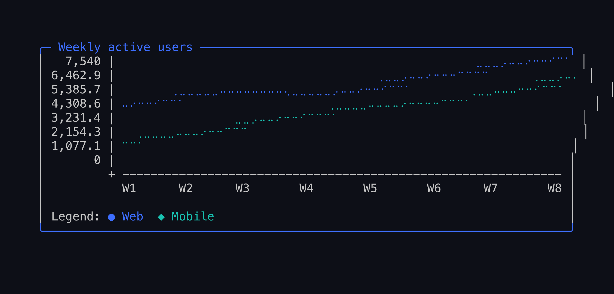
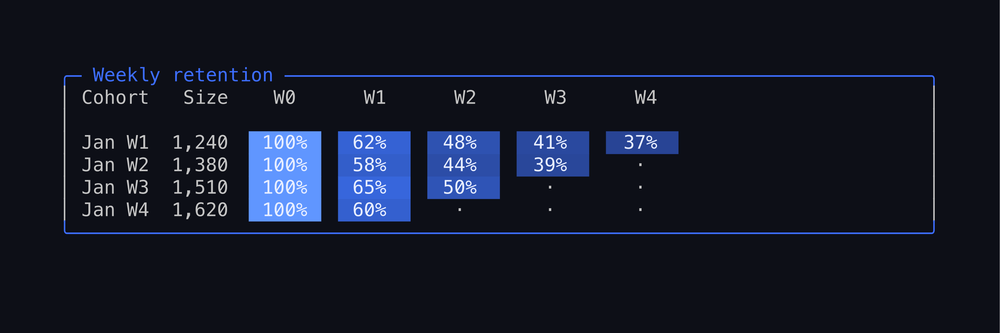
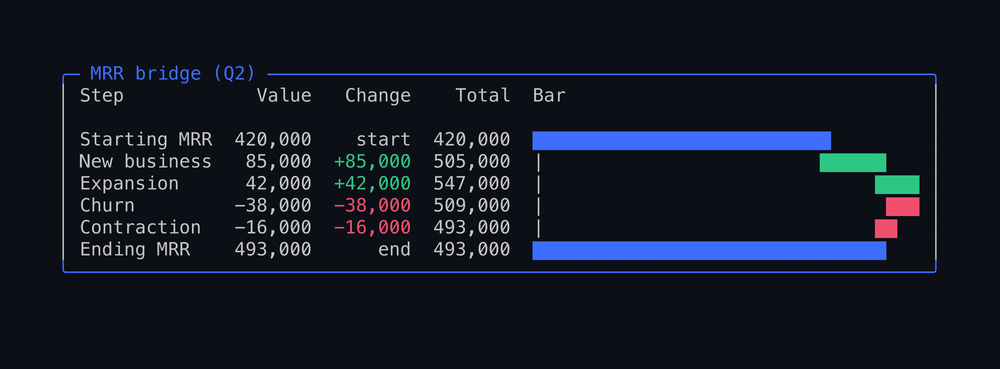

# agentviz

**Beautiful charts inside your CLI.**

`agentviz` is a terminal-chart *design system*: every chart kind draws from one
shared set of components (bordered panels, a canonical palette, color-coded
labels, sub-cell glyphs), so output comes out beautiful and legible without the
caller tuning anything — and composes into full dashboards. Truecolor on a TTY;
clean monochrome Unicode when piped or captured (the common case inside coding
agents like Claude Code / Codex). It's for agents that need to show evidence in a
CLI, PR comment, or transcript without dumping raw CSV or hiding denominators.

## Gallery

A composed growth dashboard — KPI tiles with semantic deltas, a trend with a
goal line, a funnel, and a retention heatmap, all from one spec:



KPI tiles (semantic green-good / red-bad deltas + sparklines) and a quadrant
scatter (winners green / laggards red):




Funnel, bar, line (braille + area), retention heatmap, waterfall MRR-bridge:







```sh
agentviz dashboard fixtures/dashboard-growth.json --width 118
```

## Status

`agentviz` is staged for extraction as a private GitHub repository in Phase 1 of
the OSS release plan. It is not published to npm yet.

Planned package name:

```sh
npm install @staub/agentviz
```

[ANDREW Q] Confirm the GitHub organization before creating the private repo.

## Why

- Show the evidence, not just the conclusion.
- Preserve exact counts, denominators, and caveats.
- Keep output readable inside narrow terminals and chat transcripts.
- Avoid browser screenshots when a text report is enough.

## How it works

Two layers, inspired by visx's composable primitives and Tremor's
beautiful-by-default assembly:

- **`cli-viz/theme.ts` — primitives.** A color/degrade layer (truecolor 24-bit
  on a TTY or under `FORCE_COLOR`, clean monochrome Unicode when piped, off under
  `NO_COLOR`), one canonical blue ramp shared across kinds, a coherent categorical
  palette, and the glyph sets (eighth blocks `▏▎▍▌▋▊▉█` for sub-cell-precise bars,
  box drawing for chrome, shades for tracks/heat).
- **`cli-viz/components.ts` — composable chrome.** `panel` (rounded border with a
  colored title in the top edge), `legend`, `swatch`, `colorLabel`, `meter`, and
  `meterTable`. Charts assemble these with sensible defaults, so the common case
  is one call and comes out beautiful with zero tuning.

Color is decided once, at the edge: a terminal gets truecolor; a pipe or a
captured transcript gets the same layout in clean monochrome Unicode. Same
geometry either way.

**Light or dark background.** There are two tuned palettes from the same blue
family — one for dark terminals, one for light. `--appearance light|dark|auto`
(or the `appearance` option) picks; `auto` detects a light terminal from the
`COLORFGBG` env var and otherwise defaults to dark (no change to existing
output). Switching only swaps colors — never geometry — so every kind adapts
with no per-kind change. On light it: colors primary text deep navy and
secondary text a dark slate (a light terminal's default fg is dark, but ANSI
can't set the *default*, so the text carries its own color); deepens the blue
ramp so it stays legible on white; raises the heatmap's lowest cell to a
faint-but-visible tint (a low cohort reads as a tinted cell, an absent one as a
bare dot); and deepens the green/red/amber accents to pop on white.

```sh
agentviz retention fixtures/retention-weekly.json --appearance light --width 78
```

Both palettes are kept honest by QA that covers both backgrounds:
`scripts/qa-gallery.sh` regenerates `docs/screenshots/<kind>.{dark,light}.png`
for every kind (read the pairs side by side), and the equal-visible-width
regression test asserts the single-column right border under **both**
appearances — so neither theme can regress unseen.

**Line & sparkline** are on the same system: the wide line chart renders in a
titled panel with per-series color (each series keyed to the palette, matching
its legend swatch). The default style draws an inline grid (so goal lines, vline
markers, and shaded spans render in place); `lineStyle: "braille"` switches to
smooth 2×4 sub-cell curves, and `area: true` fills under the line.

```sh
agentviz line fixtures/line-weekly-active.json --width 76                 # colored grid
agentviz line fixtures/line-weekly-active.json --width 76 --linestyle braille  # smooth
agentviz line fixtures/line-latency.json --width 64                       # area fill
```

**Retention** renders as a cohort heatmap: each period cell is a solid block
shaded by its retention rate (truecolor `heat()` ramp on a TTY; `░▒▓█` shade
glyphs when mono), with jagged cohorts showing a dot for unobserved periods.

```sh
agentviz retention fixtures/retention-weekly.json --width 78
```

The **bar-family** kinds share the same chrome: **stacked** draws a colored
stacked bar + legend + total; **grouped** draws palette-colored grouped columns;
**waterfall** tints bars by kind (gains green, drops red, start/end accent) with
a sign-tinted change column — an MRR bridge that reads at a glance.

```sh
agentviz stacked   fixtures/stacked-plan-mix.json     --width 72
agentviz grouped   fixtures/grouped-engagement.json   --width 72
agentviz waterfall fixtures/waterfall-mrr-bridge.json --width 80
```

## CLI

Pass a chart type and a JSON file, or pipe JSON through stdin.

```sh
agentviz line report.json --width 96
cat report.json | agentviz funnel
cat filters.json | agentviz filters
```

Minimal line chart input:

```json
{
  "title": "Activation",
  "series": [
    {
      "label": "Page views",
      "points": [
        { "label": "Mon", "value": 120 },
        { "label": "Tue", "value": 180 }
      ]
    }
  ],
  "filters": [
    { "scope": "property", "field": "$current_url", "operator": "contains", "value": "/setup" }
  ]
}
```

```sh
agentviz line activation.json
```

Supported charts:

- `bar`
- `bignumber`
- `filters`
- `funnel`
- `grouped`
- `line`
- `retention`
- `scatter`
- `sparkline`
- `stacked`
- `table`
- `waterfall`

## API

```ts
import { renderFunnelBars } from "@staub/agentviz";

console.log(renderFunnelBars([
  { label: "Visited pricing", count: 1200 },
  { label: "Started checkout", count: 420 },
  { label: "Paid", count: 180 },
], { width: 72 }));
```

### Line chart annotations

`renderLineChart` accepts four optional annotation fields for product-change
markers, not-comparable regions, footer provenance, and dense-axis label
strategies. All fields are optional and backwards compatible.

```ts
import { renderLineChart } from "@staub/agentviz";

console.log(renderLineChart(series, {
  width: 96,
  height: 8,
  vlines: [
    { at: "2025-09", label: "launch", position: "above" },
  ],
  shades: [
    { from: "2025-08", to: "2025-09", label: "pre-launch", pattern: "gray" },
  ],
  footer: "queried 2026-05-18 from prod readonly | n=28,661",
  xAxisLabels: "auto", // or "stagger" or { skipEvery: 3 }
}));
```

CLI equivalents (repeatable where noted):

```sh
agentviz line trend.json \
  --vline at=2025-09,label=launch \
  --shade from=2025-08,to=2025-09,label=pre-launch,pattern=gray \
  --footer "queried 2026-05-18" \
  --xaxis-labels stagger
```

- `vlines` — vertical marker drawn at the bucket whose label matches `at`. Unmatched `at` values are silently skipped. `position` is `above` (default) or `below`.
- `shades` — background fill across the inclusive `from`-to-`to` bucket range. `pattern` is `gray` (default, `░`), `hatch` (`▒`), or `dotted` (`·`). Series markers and lines paint over shade chars.
- `footer` — free-text line printed below the legend, wrapped at `width`. Caller is responsible for embedding timestamps, source paths, or row counts.
- `xAxisLabels` — `auto` (default; falls back to `skipEvery` when labels collide), `stagger` (two alternating rows), or `{ skipEvery: N }` (every Nth label only).

Narrow-width behavior (`width < 54`): the chart falls back to per-series sparklines because the full grid does not fit. The annotation fields still surface as compact summary lines below the sparklines:

- `footer` is always printed, wrapped at the requested width.
- Labelled `vlines` collapse into a single `Marks: at=label  ...` line.
- Labelled `shades` collapse into a single `Shaded: ░ from-to=label  ...` line using the same pattern character as the full chart.

Unlabelled vlines and shades are dropped at narrow widths since their position cannot be drawn.

### Grouped bar charts

`renderGroupedBarChart` draws multiple series side-by-side per bucket — the
non-stacked complement to `renderStackedBarChart`. Use it for a trend with more
than one metric per period (e.g. followed-vs-signed-up per week). Each series
gets its own fill symbol (`A`, `B`, …) keyed to the legend. All options are
optional and backwards compatible.

```ts
import { renderGroupedBarChart } from "@staub/agentviz";

console.log(renderGroupedBarChart([
  { label: "W1", bars: [{ key: "followed", label: "Followed", value: 40 }, { key: "signed_up", label: "Signed up", value: 12 }] },
  { label: "W2", bars: [{ key: "followed", label: "Followed", value: 55 }, { key: "signed_up", label: "Signed up", value: 20 }] },
  { label: "W3", bars: [{ key: "followed", label: "Followed", value: 70 }, { key: "signed_up", label: "Signed up", value: 38 }] },
], {
  width: 72,
  markers: [{ at: "W2", label: "shipped" }],   // vertical rule at a bucket
  seriesOrder: ["followed", "signed_up"],        // explicit left-to-right order
  // valueFormat: "percent" / unit: { prefix: "$" } / footer / height
}));
```

CLI:

```sh
agentviz grouped trend.json --width 72 --marker at=W2,label=shipped --footer "queried 2026-06-01"
```

- `markers` (`--marker at=<bucket>[,label=<text>]`) — a vertical rule drawn at the bucket whose label matches `at`; bars paint over it on a collision, and the label prints above the plot. Unmatched `at` values are silently skipped. This is the bar-chart analogue of `vlines` on line charts.
- `seriesOrder` — explicit left-to-right series order by key; unlisted keys follow in first-seen order.
- `valueFormat` / `unit` / `footer` / `height` behave as on the line chart.

Narrow-width behavior (`width < 54`, or when the groups can't fit): the chart
falls back to a per-bucket block listing of each series value, and labelled
markers collapse into a single `Marks: at=label  …` line so nothing is dropped.

### Goal lines & y-axis units

`renderLineChart` can draw a horizontal target line and format the y-axis with
units. All optional and backwards compatible.

```ts
renderLineChart(series, {
  goal: 180,
  goalLabel: "Q2 target",     // legend reads: Q2 target ╌ $180
  unit: { prefix: "$" },      // axis labels: $0, $90, $180 …
  // or: valueFormat: "percent" for 0–1 ratios → 0%, 50%, 100%
});
```

The goal line is drawn dashed (`╌`) only on empty cells, so series always win on
a collision. At narrow widths it collapses to a `Goal: <value>` annotation.

### High-resolution braille lines

`lineStyle: "braille"` plots the line body at 2×4 sub-cell resolution (Unicode
braille), giving ~8× the density of block characters at the same width — smooth
curves without leaving the terminal. Axis, x-labels, legend, goal, and footer
render the same; `vlines`/`shades` collapse to compact `Marks:`/`Shaded:` lines.
Below 54 columns it falls back to per-series sparklines.

```sh
agentviz line trend.json --linestyle braille --width 96
```

### Big numbers

`renderBigNumber` renders a single headline metric with an optional
period-over-period delta and sparkline — the most common dashboard tile.

```ts
import { renderBigNumber } from "@staub/agentviz";

renderBigNumber(1234, {
  label: "Weekly signups",
  previous: 1102,                 // ▲ 12% vs previous (1,102)
  sparkline: [900, 1102, 1050, 1234],
  unit: { prefix: "$" },          // or format: "percent" | "compact"
  goodDirection: "up",            // color (when enabled): up = green
});
```

```sh
echo '{"value":1234,"options":{"label":"Weekly signups","previous":1102}}' | agentviz bignumber
```

Like every chart, output is plain text with no color unless `color` is set, so it
survives transcripts and copy/paste.

Run the bundled synthetic render:

```sh
bun run example
```

## Integrity (`--integrity` + `agentviz verify`)

Opt-in tamper-evident output. When an agent shows a chart in a transcript, the
operator can verify the chart was actually produced by agentviz instead of
hand-edited prose.

```sh
agentviz line report.json --integrity > chart.txt
agentviz verify chart.txt
# OK (chart=line agentviz=0.1.3 sha256=…)

# Operator suspects fabrication or edit:
agentviz verify suspicious-chart.txt
# TAMPERED (…)
#   reason: re-rendered body from embedded spec does not match block body —
#           chart was hand-edited
```

With `--integrity`, rendered output is wrapped in a marker block:

```
‹‹‹agentviz/0.1.3 chart:line sha256:<64-hex> spec:<base64-json>›››
[chart content]
‹‹‹/agentviz›››
```

The block carries the full canonical spec (chart kind, title, width, series,
options, line annotations — everything needed to reproduce the body) as
base64-encoded JSON, plus a sha256 hash binding the version, chart, spec,
and body together.

`agentviz verify` runs two checks:

1. **Hash check.** Recomputes sha256(version, chart, spec, body) from the
   embedded spec and the current body. Catches any edit to the body, spec,
   version, chart, or the hash itself.
2. **Re-render check.** Re-renders the embedded spec via `renderAgentVizSpec`
   and compares byte-exactly to the block body. This is the stronger guarantee:
   without it, anyone with `sha256sum` could fabricate a block by editing the
   body and recomputing the hash. With it, a passing block means the body is
   what agentviz would produce for the embedded spec, on this version of
   agentviz, running locally — which is the strongest claim possible without
   a server-side signing key.

Caveats:

- Content outside the marker block is not covered by the hash. `agentviz
  verify` surfaces a byte-count note when leading or trailing text is present
  so operators do not treat the whole file as verified.
- Re-render comparison uses the running agentviz version's renderer. If you
  verify a block produced by an older agentviz version whose renderer has
  since changed, the re-render check will report TAMPERED even though the
  block itself is genuine. Re-render with the matching version when this
  matters.
- This is layer 2 of chart-fabrication resistance. Layer 1 is making the
  renderer good enough that an agent does not want to hand-edit in the first
  place. Use `--integrity` for charts that will inform real decisions.

Default behavior is unchanged: without `--integrity`, output is byte-identical
to prior releases.

## What It Draws

- tables
- bars and sparklines
- big numbers with period-over-period delta
- funnels with previous-step and total retention
- line charts (block, high-resolution braille, or filled area), with goal lines and y-axis units
- filter summaries and suggested filters
- retention heatmaps
- stacked bars
- grouped (side-by-side) bars with vertical markers
- waterfall charts
- scatter plots
- dashboards — a grid of KPI tiles + charts composed into one multi-panel view

## Boundaries

`agentviz` is source-agnostic. It does not know about analytics tools,
warehouses, saved insights, credentials, or freshness. Source-specific packages
should normalize their data first, then call `agentviz`.

Filter summaries are display-only. `agentviz` can show which filters shaped a
chart, and which filters an adapter recommends, but it does not query,
translate, or validate source-specific filter semantics.

## Safety

- Local reads: none beyond files imported by the caller.
- Local writes: none.
- Network: none.
- Credentials: none.
- Private data: callers must pass already-redacted data.

## Extraction

See `EXTRACTION.md` for the private-repo split path from this monorepo staging
folder. Roadmap reference: `plans/2026-05-14-oss-extraction-roadmap.md`.

## License

MIT

## Public Launch Gate

- package name confirmed;
- private GitHub repo created in the confirmed organization;
- tests pass inside the extracted package;
- README examples match actual output;
- no customer names, local paths, or private fixtures remain.
